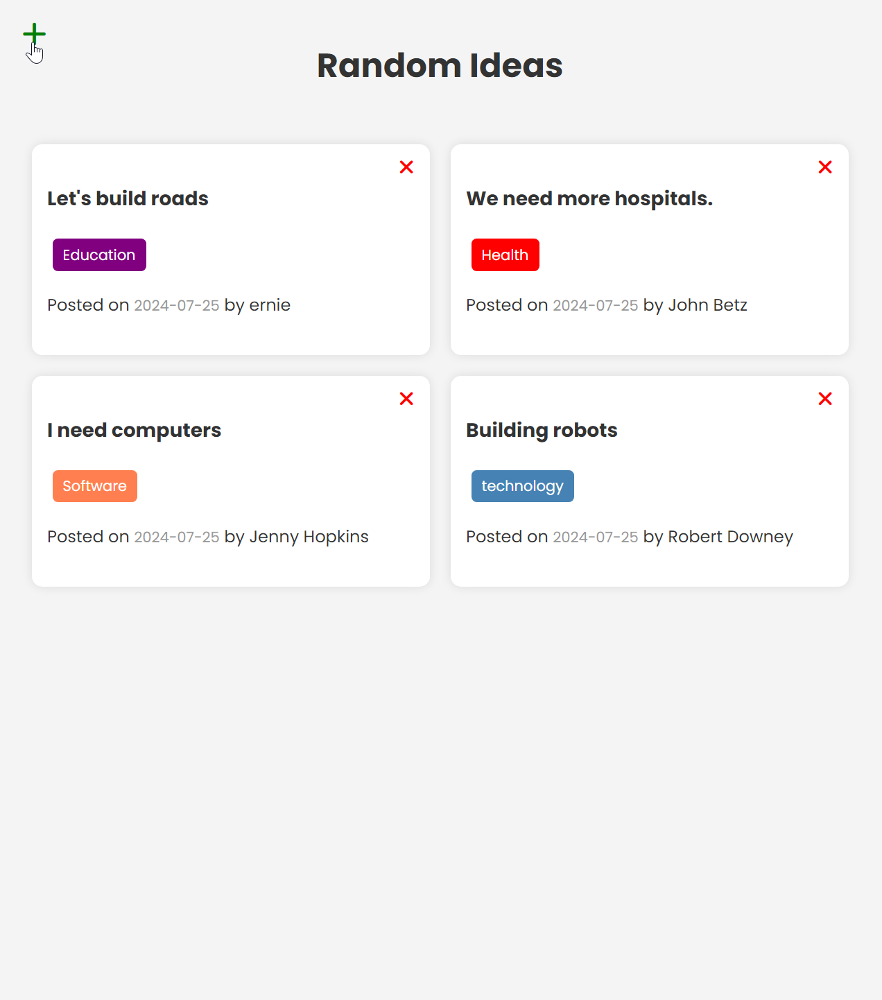

### 👋 **I am Erhan ERTEM**

### Udemy Modern JavaScript From The Beginning by Brad Traversy

#### **Objective:** RandomIdeas App

-  Backend and FrontEnd Mini Project

&emsp;

#### Link to Project &rarr; [RandomIdeas](https://randomideas-app-erhan-ertem.netlify.app)

#### Project Preview

---

    

Installed NPM packages and utilized APIs:

| Package command | Package link | Description |
| --------------- | ------------ | ----------- |

